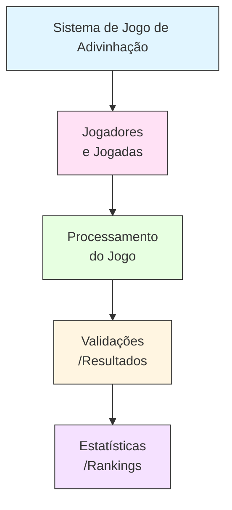
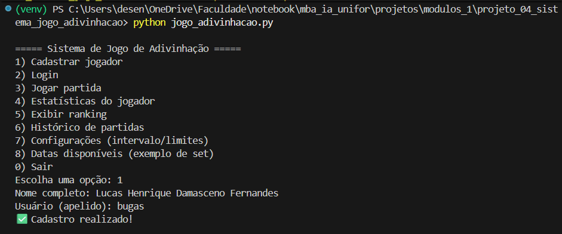
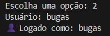
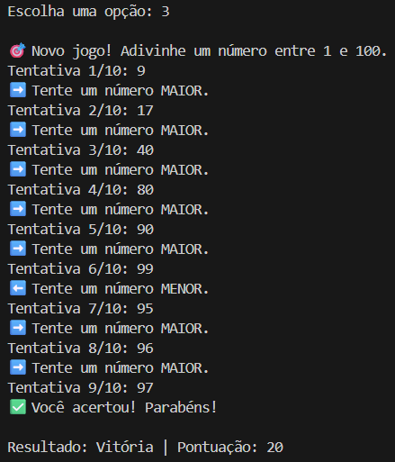
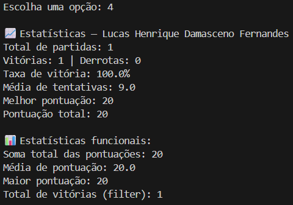
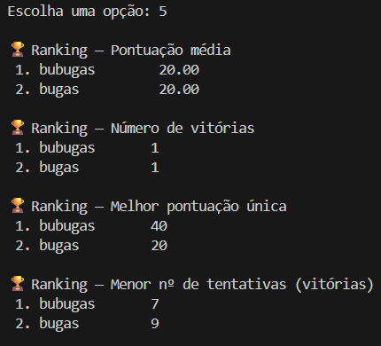
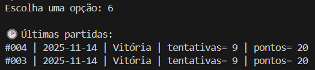
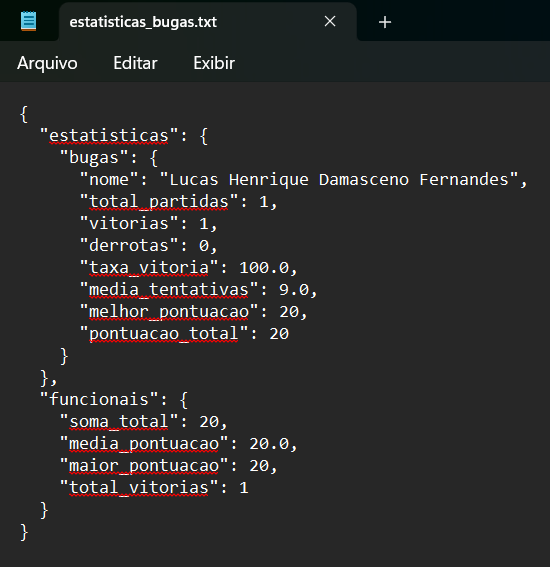
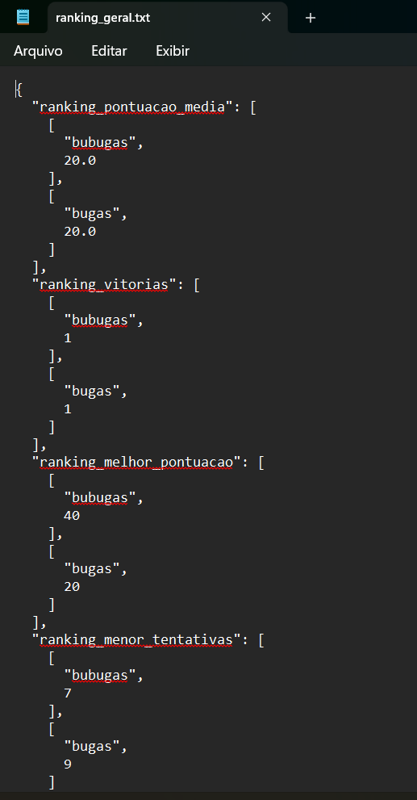
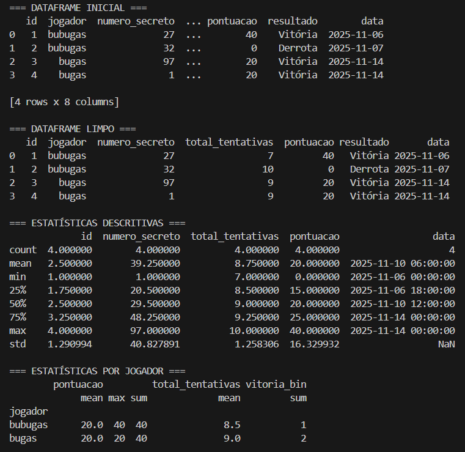

# 1. Projeto 04: Sistema de Jogo de Adivinhação com Estatísticas
 **Disciplina:** Programação para Ciência de Dados  
**Curso:** MBA Ciência de Dados - UNIFOR  
**Instrutor:** Cássio Pinheiro  
**Integrantes:** - Lucas Henrique Damasceno Fernandes (2527287)
 **Repositório GitHub:** https://github.com/lucashenriq02/projeto_04_sistema_jogo_adivinhacao.git
 **Data de Entrega:** 14/11/2025

 ---

# 2. 🎯 Objetivo do Projeto

O **Sistema de Jogo de Adivinhação** foi desenvolvido em Python com o propósito de aplicar conceitos de lógica de programação, controle de fluxo, manipulação de dados e criação de relatórios.

O sistema permite que múltiplos jogadores participem de partidas de adivinhação numérica, registrando suas estatísticas individuais, pontuações e gerando rankings de desempenho.

O projeto propõe um ambiente para exercitar fundamentos de **programação estruturada**, **persistência de dados** e **análise estatística** simples, simulando um sistema de jogo interativo completo com histórico e relatórios automáticos.

---

---

# 3. 🗺️ Diagrama de Contexto (Mermaid)

# 4. 🔧 Funcionalidades Básicas

## 4.1. Sistema de Jogo
    - Geração de número secreto
    - Controle de tentativas
    - Dicas (maior/menor)
    - Cálculo de pontuação
    - Exibição de resultado

## 4.2. Gestão de Jogadores
    - Cadastro de novos jogadores
    - Login de jogadores existentes
    - Persistência de dados em arquivo

## 4.3. Registro de Partidas
    - Armazenamento de número secreto, tentativas e resultado
    - Histórico de partidas com data e pontuação
    - Identificação única por partida

## 4.4. Estatísticas
   - Taxa de vitórias
   - Média de tentativas
   - Melhor pontuação
   - Pontuação total
   - Relatório individual de desempenho

## 4.5. Rankings
   - Ranking por pontuação média
   - Ranking por número de vitórias
   - Ranking por melhor pontuação única
   - Ranking por menor número de tentativas
   - Relatório consolidado de rankings

## 4.6. Relatórios
   - Histórico recente de partidas
   - Exportação automática de estatísticas
   - Organização de relatórios por jogador

## 4.7. Configurações e Menu Interativo
   - Menu principal com todas as opções do sistema
   - Alteração de parâmetros de jogo (intervalo e tentativas)
   - Feedback dinâmico ao usuário

## 4.8. Estrutura e Persistência de Dados
   - Criação automática de diretórios e arquivos
   - Armazenamento em formato JSON
   - Leitura e atualização contínua dos dados

# 5. 📊 Estrutura de Dados

O sistema utiliza estruturas de dados nativas do Python (listas, dicionários), persistência em arquivos .txt no formato JSON e DataFrames gerados com Pandas para análises estatísticas.

A seguir estão os modelos utilizados, exemplos de entrada e saída e os formatos dos arquivos.

## 5.1 Modelos de Dados Utilizados
📌 Jogador (dict)

Representa um jogador cadastrado no sistema.

{
  "nome": "Lucas Henrique",
  "usuario": "lucas123",
  "data_cadastro": "2025-11-07"
}

📌 Partida (dict)

Registro completo de uma partida jogada.

{
  "id": 12,
  "jogador": "lucas123",
  "numero_secreto": 57,
  "tentativas": [30, 50, 57],
  "total_tentativas": 3,
  "pontuacao": 80,
  "resultado": "Vitória",
  "data": "2025-11-08"
}

📌 Estatísticas do Jogador (dict)

Gerado automaticamente pelo sistema após o processamento das partidas.

{
  "lucas123": {
    "nome": "Lucas Henrique",
    "total_partidas": 8,
    "vitorias": 5,
    "derrotas": 3,
    "taxa_vitoria": 62.5,
    "media_tentativas": 4.12,
    "melhor_pontuacao": 100,
    "pontuacao_total": 540
  }
}

📌 Rankings (list de tuplas)

Exemplo de ranking por média de pontuação.

[
    ("lucas123", 82.5),
    ("maria456", 75.0),
    ("joao999", 68.3)
]

## 5.2 Exemplos de Estruturas de Entrada
📌 Cadastro de Jogador
cadastrar_jogador("Lucas Henrique", "lucas123")

📌 Entrada de Tentativa
validar_numero("42")   # retorna 42
validar_numero("abc")  # retorna None

### 5.3 Exemplos de Estruturas de Saída
📌 Resultado de Partida
{
  "id": 15,
  "jogador": "lucas123",
  "resultado": "Vitória",
  "pontuacao": 70,
  "total_tentativas": 4,
  "tentativas": [10, 30, 45, 48],
  "numero_secreto": 48,
  "data": "2025-11-09"
}

📌 Histórico de Partidas (últimos 10 registros)
[
  {
    "id": 15,
    "resultado": "Vitória",
    "pontuacao": 70,
    "total_tentativas": 4,
    "data": "2025-11-09"
  },
  {
    "id": 14,
    "resultado": "Derrota",
    "pontuacao": 0,
    "total_tentativas": 10,
    "data": "2025-11-08"
  }
]

📌 DataFrame Pandas utilizado na análise (analise_dado.py)
     id   jogador  total_tentativas  pontuacao  resultado
0     1  lucas123                3         80    Vitória
1     2  lucas123                5         60    Vitória
2     3  maria456                8          0    Derrota

### 5.4 Formato dos Arquivos de Dados
📁 dados/jogadores.txt
{
  "lucas123": {
    "nome": "Lucas Henrique",
    "usuario": "lucas123",
    "data_cadastro": "2025-11-07"
  }
}

📁 dados/partidas.txt
[
  {
    "id": 1,
    "jogador": "lucas123",
    "numero_secreto": 47,
    "tentativas": [15, 20, 47],
    "total_tentativas": 3,
    "pontuacao": 80,
    "resultado": "Vitória",
    "data": "2025-11-07"
  }
]

📁 relatorios/estatisticas_lucas123.txt
{
  "lucas123": {
    "total_partidas": 8,
    "vitorias": 5,
    "media_tentativas": 4.12,
    "taxa_vitoria": 62.5,
    "pontuacao_total": 540
  }
}

📁 relatorios/ranking_geral.txt
{
  "ranking_pontuacao_media": [
    ["lucas123", 82.5]
  ],
  "ranking_vitorias": [
    ["lucas123", 5]
  ],
  "ranking_melhor_pontuacao": [
    ["lucas123", 100]
  ],
  "ranking_menor_tentativas": [
    ["lucas123", 3]
  ]
}

# 6. 🖥️ Requisitos Técnicos

O projeto utiliza Python 3 e algumas bibliotecas essenciais para manipulação de dados e geração de gráficos.
A seguir estão os requisitos completos para execução, instalação e compatibilidade.

## 6.1 Versão do Python Utilizada
Componente	Versão
Python	3.13.2

O sistema é totalmente compatível com Python 3.9+.

## 6.2 Bibliotecas e Dependências

O projeto utiliza as seguintes bibliotecas:

Biblioteca	Finalidade
json (nativo)	Persistência de dados em arquivos .txt
os (nativo)	Manipulação de diretórios e caminhos
random (nativo)	Geração de números aleatórios
datetime (nativo)	Registro de datas (cadastro e partidas)
pandas	Leitura, tratamento e análise de dados
numpy	Arrays, operações vetorizadas e estatísticas
matplotlib	Visualização de dados e gráficos
seaborn	Visualizações estatísticas avançadas

## 6.3 Arquivo requirements.txt

O projeto inclui um arquivo pronto para instalação:

pandas
numpy
matplotlib
seaborn

Caso deseje versões fixas (opcional):

pandas==2.2.2
numpy==1.26.4
matplotlib==3.8.4
seaborn==0.13.2

## 6.4 Requisitos de Sistema

O projeto é leve e roda em qualquer ambiente:

Windows 10/11

macOS

Linux (Ubuntu/Debian/Fedora)

VS Code (recomendado)

📌 Não necessita GPU, internet ou hardware específico.

## 6.5 Como Instalar as Dependências
1️⃣ Ativar o ambiente virtual (venv)

Windows (PowerShell):
venv\Scripts\activate

Linux/macOS:
source venv/bin/activate

2️⃣ Instalar dependências
pip install -r requirements.txt

3️⃣ Verificar instalação
python -c "import pandas, numpy, matplotlib, seaborn; print('OK!')"

## 6.6 Estrutura de Pastas Necessária

A aplicação cria automaticamente estas pastas ao rodar:

dados/
relatorios/

Nada precisa ser criado manualmente.

## 6.7 Observações Técnicas Importantes

✔ O projeto utiliza persistência simples em JSON (sem banco de dados)
✔ Todos os relatórios são armazenados em formato .txt
✔ A análise de dados e gráficos são gerados no arquivo analise_dado.py
✔ Compatível com uso em Jupyter Notebook se necessário
✔ Totalmente standalone — basta baixar e executar

# 7. 🚀 Como Executar o Projeto

Siga as etapas abaixo para instalar, configurar e executar o sistema de forma correta.

## 7.1. Pré-requisitos

Antes de iniciar, você precisa ter instalado:

Python 3.8+

pip (gerenciador de pacotes do Python)

Git (opcional, para clonar o repositório)

## 7.2. Clonando o Repositório
git clone https://github.com/lucashenriq02/projeto_04_sistema_jogo_adivinhacao.git
cd projeto_04_sistema_jogo_adivinhacao

## 7.3. Criando e Ativando o Ambiente Virtual (venv)
Windows (PowerShell):
python -m venv venv
venv\Scripts\Activate.ps1

Mac/Linux:
python3 -m venv venv
source venv/bin/activate

## 7.4. Instalando as Dependências

O projeto possui um arquivo requirements.txt com todas as bibliotecas necessárias.

Execute:

pip install -r requirements.txt

## 7.5. Executando o Jogo Principal

Para iniciar o sistema interativo no terminal:

python jogo_adivinhacao.py

## 7.6. Executando o Script de Análises (Pandas + NumPy + Gráficos)
python analise_dado.py

Esse script gera:

✔ DataFrames com dados dos jogadores e partidas
✔ Estatísticas automáticas
✔ Gráficos em Matplotlib e Seaborn
✔ Relatórios adicionais

## 7.7. Exemplos de Comandos Úteis
Atualizar dependências:
pip freeze > requirements.txt

Desativar venv:
deactivate

# 8. 📊 Análises Realizadas

Esta seção apresenta as análises estatísticas, estruturais e visuais realizadas a partir dos dados das partidas registradas no sistema.
Para isso, foi utilizado o módulo analise_dado.py, que lê os arquivos JSON e os transforma em DataFrames para inspeção.

### 8.1 📥 Carregamento e Preparação dos Dados

Os dados são carregados a partir dos arquivos:

dados/jogadores.txt

dados/partidas.txt

E convertidos para DataFrames utilizando:

import pandas as pd
import numpy as np

Foram realizadas:

Normalização de colunas

Conversão de datas (datetime)

Remoção de duplicatas (se existirem)

Tratamento de valores ausentes

Criação de novas colunas derivadas (como taxa de acerto)

### 8.2 📈 Estatísticas Descritivas

Com Pandas e NumPy, foram calculadas estatísticas fundamentais:

Média e mediana de tentativas

Desvio padrão

Distribuição de pontuação

Taxa geral de vitórias

Correlação entre número de tentativas e pontuação

Exemplo:

df_partidas['pontuacao'].describe()
df_partidas['total_tentativas'].mean()
df_partidas.corr(numeric_only=True)

Essas estatísticas permitem entender:

Dificuldade média do jogo

Distribuição de desempenho

Padrões de comportamento dos jogadores

### 8.3 🔍 Filtragem, Seleção e Agrupamentos

Foram utilizadas operações de:

Filtro por jogador

Agrupamento por resultado

Agrupamento por data

Médias por jogador (groupby)

Exemplo:

df_partidas.groupby("jogador")["pontuacao"].mean()
df_partidas.groupby("resultado").size()
df_partidas.groupby("data")["pontuacao"].mean()

Esses agrupamentos permitem:

Comparar desempenho entre jogadores

Avaliar evolução temporal

Identificar padrões de vitória/derrota

### 8.4 📊 Visualizações Criadas

Com Matplotlib e Seaborn, foram gerados gráficos para análise visual dos dados:

✔ Histograma de Pontuações

Mostra a distribuição geral das pontuações.

✔ Histograma de Tentativas

Avalia quantas tentativas os jogadores costumam usar.

✔ Gráfico de Linha (pontuação por data)

Mostra evolução temporal do desempenho.

✔ Gráfico de Barras (vitórias por jogador)

Compara performance entre usuários.

✔ Boxplot

Mostra dispersão das pontuações.

✔ Heatmap de Correlação

Destaca relações entre:

tentativas

pontuação

vitória/derrota

### 8.5 🔎 Principais Insights Encontrados

Com base nas análises, foram observados:

🟢 1. A maioria das pontuações se concentra entre 60 e 100

Jogadores tendem a acertar antes do final das tentativas.

🟢 2. O número total de tentativas tem forte correlação inversa com pontuação

Quanto mais o jogador tenta, menor sua pontuação.

🟡 3. Alguns jogadores apresentam quedas abruptas de desempenho

Identificado por gráficos temporais.

🔵 4. Vitórias são mais frequentes do que derrotas

Mostrado pela distribuição do campo resultado.

🟣 5. Jogadores com mais partidas tendem a ter médias melhores

Revelado no agrupamento por jogador.

### 8.6 📁 Arquivos Gerados

A análise produz automaticamente:

relatorios/estatisticas_bubugas.txt → estatísticas gerais

relatorios/ranking_geral.txt → ranking consolidado

Gráficos exibidos no notebook ou terminal (não persistidos como imagem, mas podem ser adicionados)

# 9. 📁 Estrutura do Projeto

A organização do projeto segue um padrão profissional, com separação clara entre código-fonte, dados, relatórios e ambiente virtual.
A estrutura permite fácil manutenção, expansão e análise dos dados gerados.

projeto_04_sistema_jogo_adivinhacao/
│
├── 📜 jogo_adivinhacao.py        # Sistema principal (CLI)
├── 📜 analise_dado.py            # Análises com Pandas/NumPy/Matplotlib/Seaborn
├── 📄 README.md                  # Documentação completa
├── 📄 requirements.txt           # Dependências do projeto
├── ⚙️ .gitignore                 # Arquivos ignorados pelo Git
│
├── 📁 dados/                     # Persistência dos dados
│   ├── 📄 jogadores.txt          # Registro de usuários
│   └── 📄 partidas.txt           # Histórico completo das partidas
│
├── 📁 relatorios/                # Relatórios gerados automaticamente
│   ├── 📄 ranking_geral.txt
│   └── 📄 estatisticas_[usuario].txt
│
├── 📁 images/                    # Imagens utilizadas no README
│   ├── 🖼️ menu_cadastro.png
│   └── 🖼️ login.png
│
└── 📁 venv/                      # Ambiente virtual do Python
    ├── 📁 Scripts/
    ├── 📁 Lib/
    └── ...

### 9.1 🧱 Diretórios Principais
📌 dados/

Onde ficam armazenados os arquivos de persistência:

jogadores.txt → salva o dicionário de jogadores

partidas.txt → salva a lista completa de partidas realizadas

Ambos são gravados em formato JSON para facilitar leitura e expansão futura.

📌 relatorios/

Gerado automaticamente pelo sistema para armazenar:

Relatórios individuais dos jogadores

Relatório geral de ranking

Estatísticas em formato .txt

Isso garante rastreabilidade e documentação do desempenho ao longo do tempo.

📌 venv/

Ambiente virtual com todas as dependências:

Pandas

NumPy

Matplotlib

Seaborn

Esse diretório não é enviado ao GitHub (graças ao seu .gitignore).

📌 Arquivos do Projeto
jogo_adivinhacao.py

Contém:

Lógica do jogo

Cadastro

Estatísticas

Rankings

Sistema de persistência

Menus

Funções auxiliares

É o núcleo do projeto.

analise_dado.py

Responsável por:

Ler os dados das partidas

Criar DataFrames com Pandas

Realizar análises estatísticas

Gerar gráficos (histogramas, barras, boxplots, heatmap, etc.)

Demonstrar o uso de NumPy e operações vetorizadas

requirements.txt

Lista completa de bibliotecas necessárias para rodar:

pandas
numpy
matplotlib
seaborn

README.md

Documentação oficial e completa, seguindo o padrão exigido pelo professor.

### 9.2 ✔ Organização Pensada para Expansão

A estrutura permite facilmente adicionar:

Novas análises em analise_dado.py

Notebooks (Jupyter)

APIs futuras

Sistema de login com senha

Persistência em banco SQLite

# 10. 🖼️ Capturas de Tela / Exemplos de Saída

A seguir, são apresentados exemplos reais de saída do sistema, ilustrando o funcionamento das principais funcionalidades do projeto.

## 10.1 📌 Exemplo — Cadastro de Jogador

## 10.2 📌 Exemplo — Login

## 10.3 🎮 Exemplo — Jogando uma Partida

## 10.4 📊 Exemplo — Estatísticas do Jogador

## 10.5 🏆 Exemplo — Ranking Geral

## 10.6 🕑 Exemplo — Histórico de Partidas

## 10.7 📁 Exemplo — Arquivo de Estatísticas Gerado

## 10.8 📁 Exemplo — Ranking Consolidado Gerado
(images/ranking_geral.txt)

## 10.9 📉 Exemplos de Gráficos Gerados (Matplotlib / Seaborn)

## 11. 🧪 Testes Realizados

Durante o desenvolvimento do projeto, foram realizados diversos testes para garantir o correto funcionamento do sistema, cobrindo desde operações básicas até análises avançadas.

# 11.1 Cenários Testados

Cadastro de jogadores com diferentes nomes e usuários

Tentativas de cadastro duplicado (esperado: erro)

Login com usuário válido

Login com usuário inexistente

Execução completa de partidas com vitória

Execução de partidas com derrota

Partidas usando valores inválidos (texto, números fora do intervalo)

Estatísticas com zero partidas

Estatísticas após múltiplas partidas

Geração de rankings com múltiplos jogadores

Histórico de partidas em ordem cronológica

Configuração de limites do jogo (mínimo, máximo, tentativas)

Análises de dados com DataFrames com dados reais

Geração automática das pastas analise_de_dados/analise_X

Salvamento de gráficos Matplotlib/Seaborn

# 11.2 Resultados Obtidos

Cadastro funcionando corretamente e persistindo os dados

Validação adequada para entradas inválidas

Pontuação calculada com precisão

Rankings gerados e ordenados corretamente

Arquivos JSON atualizados automaticamente

Relatórios de estatísticas e ranking gerados corretamente

Análises em Pandas funcionando sem erros

Gráficos salvos automaticamente nas pastas corretas

Nenhum erro em conversão de tipos, duplicação ou datas

Consistência total entre dados do jogo e análises produzidas

# 11.3 Validações Implementadas

Verificação de usuário duplicado

Garantia de que nome e usuário não são vazios

Validação de entrada numérica no jogo

Restrições de intervalo (min e max do número secreto)

Validação de limites configurados

Try/except para leitura e escrita de arquivos

Conversão segura de datas (Pandas to_datetime)

Remoção segura da coluna tentativas (listas)

Proteção contra DataFrames vazios ou corrompidos

## 12. 📚 Referências e Bibliografia
# 12.1 Documentação Consultada

Documentação oficial do Python
https://docs.python.org/3/

Documentação do Pandas
https://pandas.pydata.org/docs/

Documentação do NumPy
https://numpy.org/doc/

Documentação do Matplotlib
https://matplotlib.org/stable/

Documentação do Seaborn
https://seaborn.pydata.org/

# 12.2 Datasets Utilizados

O projeto utiliza dataset próprio, gerado automaticamente pelo sistema:

dados/jogadores.txt — Registro de jogadores

dados/partidas.txt — Histórico de partidas acumulado (JSON)

Além disso, para análise de dados, foi gerado um dataset processado internamente:

analise_de_dados/analise_X/ — Gráficos e estatísticas

Não foram utilizados datasets externos.

# 14. 🚀 Próximos Passos / Melhorias Futuras
## 14.1 Funcionalidades que Poderiam Ser Adicionadas (Simples e Viáveis)

Redefinir pontuação e histórico do jogador

Mostrar dicas mais inteligentes (ex.: diferença entre números)

Exibir resumo da partida ao final (taxa de acerto por tentativa)

Criar níveis de dificuldade (fácil / médio / difícil)

Criar opção de excluir um jogador

Criar opção de limpar todas as partidas do sistema

Permitir exportar estatísticas para CSV

Adicionar confirmação antes de sair

Criar um contador total de partidas do sistema

Melhorar as mensagens e feedbacks do menu

Criar comparação direta entre dois jogadores

Permitir carregar configurações a partir de arquivo .txt

Adicionar um Modo Torneio, permitindo que vários jogadores disputem várias rodadas com ranking final.

## 14.2 Melhorias Técnicas (Simples)

Separar o código em módulos (jogo.py, estatisticas.py, relatorios.py)

Melhorar tratamento de erros com mensagens padronizadas

Criar funções reutilizáveis para leitura/escrita

Melhorar validações de entrada e sanitização das opções do menu

Refinar formatação de rankings e relatórios

Otimizar organização da pasta analise_X

## 14.3 Expansões do Projeto

Gráficos adicionais (linha do tempo, evolução de desempenho)

Relatórios compactos para impressão

Comparações lado a lado entre jogadores

Visualizações por dia/semana usando pandas

Exportação de dados brutos em CSV para BI