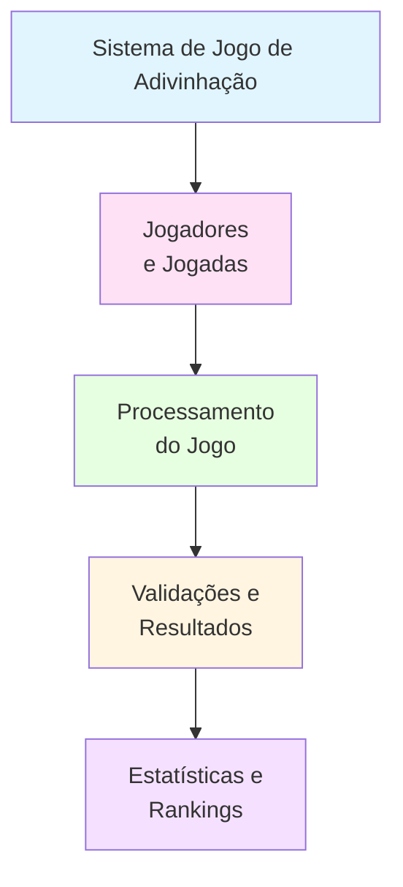

# Projeto 04: Sistema de Jogo de Adivinhação com Estatísticas

## 📋 Objetivo

Desenvolver um sistema de jogo de adivinhação numérica que permita múltiplos jogadores, registre histórico de partidas, calcule estatísticas de desempenho e gerencie rankings de jogadores.L

## 🗺️ Diagrama de Contexto



## 🔧 Funcionalidades Básicas

1. **Sistema de Jogo**
   - Gerar número aleatório em um intervalo
   - Permitir múltiplas tentativas
   - Fornecer dicas (maior/menor)
   - Calcular pontuação baseada em tentativas

2. **Gestão de Jogadores**
   - Cadastrar novos jogadores
   - Login de jogadores existentes
   - Manter histórico por jogador

3. **Registro de Partidas**
   - Registrar cada partida (jogador, número secreto, tentativas, resultado)
   - Calcular pontuação da partida
   - Armazenar histórico completo

4. **Estatísticas**
   - Taxa de vitórias por jogador
   - Média de tentativas por jogador
   - Melhor pontuação por jogador
   - Total de partidas por jogador

5. **Rankings**
   - Ranking por pontuação média
   - Ranking por número de vitórias
   - Ranking por melhor pontuação única
   - Ranking por menor número de tentativas

6. **Relatórios**
   - Relatório de desempenho individual
   - Relatório geral de todos os jogadores
   - Histórico de partidas recentes

## 📊 Estrutura de Dados

### Entrada

```python
# Cadastro de jogador
jogador = {
    'nome': 'João Silva',
    'usuario': 'joao123',
    'data_cadastro': '2024-01-15'
}

# Tentativa de jogo
tentativa = {
    'jogador': 'joao123',
    'numero_escolhido': 42,
    'tentativa_numero': 3
}
```

### Saída

```python
# Partida completa
partida = {
    'id': 1,
    'jogador': 'joao123',
    'numero_secreto': 42,
    'tentativas': [15, 35, 42],
    'total_tentativas': 3,
    'pontuacao': 70,
    'resultado': 'Vitória',
    'data': '2024-01-15'
}

# Estatísticas do jogador
estatisticas_jogador = {
    'joao123': {
        'nome': 'João Silva',
        'total_partidas': 10,
        'vitorias': 7,
        'derrotas': 3,
        'taxa_vitoria': 70.0,
        'media_tentativas': 4.2,
        'melhor_pontuacao': 100,
        'pontuacao_total': 750
    }
}

# Ranking
ranking = [
    ('joao123', 85.5),  # (usuario, pontuacao_media)
    ('maria456', 72.3),
    ('pedro789', 65.0)
]
```

## 💻 Requisitos Técnicos

- Python 3.8+
- Módulo `random` para números aleatórios
- Conhecimentos em:
  - Tipos de dados (int, float, str, dict, list)
  - Estruturas de controle (if/else, for, while)
  - Funções com parâmetros e retorno
  - Compreensões de lista e dicionário
  - Funções lambda e filter
  - Loops aninhados

## 📦 Entregáveis

1. **Código Python** (`jogo_adivinhacao.py`)
   - Módulo completo do jogo
   - Sistema de jogadores
   - Sistema de estatísticas

2. **Dados de Exemplo** (`jogadores.txt`, `partidas.txt`)
   - Arquivos com dados de exemplo
   - Formato estruturado

3. **Relatórios Gerados** (`relatorios/`)
   - Ranking de jogadores
   - Estatísticas individuais

4. **Documentação** (`README.md`)
   - Regras do jogo
   - Instruções de uso

## 💡 Dicas

1. Use `random.randint(min, max)` para gerar números aleatórios
2. Use while loop para permitir múltiplas tentativas
3. Implemente função de cálculo de pontuação:
   - Pontuação máxima = 100
   - Reduzir por cada tentativa (ex: -10 por tentativa)
4. Use dicionários para armazenar jogadores e partidas
5. Use list comprehension para filtrar partidas por jogador
6. Use sorted() com key para criar rankings
7. Implemente validação de entrada (número dentro do intervalo)
8. Use try/except para validar entrada numérica

## 🏗️ Esqueleto do Projeto

```python
# jogo_adivinhacao.py

import random
from datetime import datetime

# ============================================
# Sistema de Jogo de Adivinhação
# ============================================

jogadores = {}  # {usuario: {nome, data_cadastro}}
partidas = []   # Lista de todas as partidas
contador_partidas = 1

# Configurações do jogo
MIN_NUMERO = 1
MAX_NUMERO = 100
MAX_TENTATIVAS = 10
PONTUACAO_BASE = 100
PENALIDADE_TENTATIVA = 10

# ============================================
# FUNÇÕES DE JOGADORES
# ============================================

def cadastrar_jogador(nome, usuario):
    """
    Cadastra um novo jogador.
    
    Args:
        nome (str): Nome completo do jogador
        usuario (str): Nome de usuário único
    
    Returns:
        dict: Dados do jogador cadastrado
    """
    # TODO: Verificar se usuário já existe
    # TODO: Criar dicionário do jogador
    # TODO: Adicionar data de cadastro
    # TODO: Adicionar ao dicionário jogadores
    pass

def login_jogador(usuario):
    """
    Verifica se jogador existe e retorna dados.
    
    Args:
        usuario (str): Nome de usuário
    
    Returns:
        dict: Dados do jogador ou None
    """
    # TODO: Verificar se existe no dicionário
    # TODO: Retornar dados do jogador
    pass

# ============================================
# FUNÇÕES DE JOGO
# ============================================

def gerar_numero_secreto():
    """
    Gera um número aleatório no intervalo configurado.
    
    Returns:
        int: Número secreto
    """
    # TODO: Usar random.randint()
    pass

def calcular_pontuacao(total_tentativas):
    """
    Calcula pontuação da partida baseada em tentativas.
    
    Args:
        total_tentativas (int): Número de tentativas usadas
    
    Returns:
        int: Pontuação (0-100)
    """
    # TODO: Calcular: PONTUACAO_BASE - (tentativas * PENALIDADE)
    # TODO: Garantir que não seja negativo
    pass

def jogar_partida(usuario):
    """
    Executa uma partida completa do jogo.
    
    Args:
        usuario (str): Usuário do jogador
    
    Returns:
        dict: Dados da partida
    """
    global contador_partidas
    
    # TODO: Gerar número secreto
    # TODO: Inicializar variáveis (tentativas, lista_tentativas)
    # TODO: Loop while para tentativas
    # TODO: Validar entrada do usuário
    # TODO: Comparar com número secreto
    # TODO: Dar dicas (maior/menor)
    # TODO: Registrar tentativa
    # TODO: Verificar vitória ou derrota
    # TODO: Calcular pontuação
    # TODO: Criar dicionário da partida
    # TODO: Adicionar à lista de partidas
    # TODO: Incrementar contador
    pass

# ============================================
# FUNÇÕES DE ESTATÍSTICAS
# ============================================

def calcular_estatisticas_jogador(usuario):
    """
    Calcula estatísticas completas de um jogador.
    
    Args:
        usuario (str): Usuário do jogador
    
    Returns:
        dict: Estatísticas do jogador
    """
    # TODO: Filtrar partidas do jogador
    # TODO: Calcular totais (partidas, vitórias, derrotas)
    # TODO: Calcular taxa de vitória
    # TODO: Calcular média de tentativas
    # TODO: Encontrar melhor pontuação
    # TODO: Calcular pontuação total
    # TODO: Criar dicionário de estatísticas
    pass

def calcular_taxa_vitoria(usuario):
    """
    Calcula taxa de vitórias de um jogador.
    
    Args:
        usuario (str): Usuário do jogador
    
    Returns:
        float: Taxa de vitória (0-100)
    """
    # TODO: Filtrar partidas do jogador
    # TODO: Contar vitórias e total
    # TODO: Calcular percentual
    pass

def media_tentativas(usuario):
    """
    Calcula média de tentativas por partida de um jogador.
    
    Args:
        usuario (str): Usuário do jogador
    
    Returns:
        float: Média de tentativas
    """
    # TODO: Filtrar partidas do jogador
    # TODO: Extrair número de tentativas
    # TODO: Calcular média
    pass

# ============================================
# FUNÇÕES DE RANKINGS
# ============================================

def ranking_pontuacao_media(limite=10):
    """
    Gera ranking por pontuação média.
    
    Args:
        limite (int): Quantidade de jogadores no ranking
    
    Returns:
        list: Lista de tuplas (usuario, pontuacao_media)
    """
    # TODO: Calcular estatísticas de todos os jogadores
    # TODO: Calcular pontuação média
    # TODO: Ordenar por pontuação (decrescente)
    # TODO: Retornar top N
    pass

def ranking_vitorias(limite=10):
    """
    Gera ranking por número de vitórias.
    
    Args:
        limite (int): Quantidade de jogadores no ranking
    
    Returns:
        list: Lista de tuplas (usuario, vitorias)
    """
    # TODO: Calcular vitorias por jogador
    # TODO: Ordenar por vitórias (decrescente)
    # TODO: Retornar top N
    pass

def ranking_melhor_pontuacao(limite=10):
    """
    Gera ranking por melhor pontuação única.
    
    Args:
        limite (int): Quantidade de jogadores no ranking
    
    Returns:
        list: Lista de tuplas (usuario, melhor_pontuacao)
    """
    # TODO: Encontrar melhor pontuação de cada jogador
    # TODO: Ordenar por pontuação (decrescente)
    # TODO: Retornar top N
    pass

# ============================================
# FUNÇÕES DE RELATÓRIOS
# ============================================

def exibir_estatisticas_jogador(usuario):
    """
    Exibe estatísticas formatadas de um jogador.
    
    Args:
        usuario (str): Usuário do jogador
    """
    # TODO: Calcular estatísticas
    # TODO: Formatar e exibir com f-strings
    pass

def exibir_ranking():
    """
    Exibe ranking formatado de todos os jogadores.
    """
    # TODO: Gerar rankings
    # TODO: Formatar e exibir
    pass

def historico_partidas(usuario, limite=10):
    """
    Retorna histórico recente de partidas de um jogador.
    
    Args:
        usuario (str): Usuário do jogador
        limite (int): Quantidade de partidas a retornar
    
    Returns:
        list: Lista de partidas recentes
    """
    # TODO: Filtrar partidas do jogador
    # TODO: Ordenar por data (mais recente primeiro)
    # TODO: Retornar top N
    pass

# ============================================
# FUNÇÕES AUXILIARES
# ============================================

def validar_numero(entrada):
    """
    Valida se entrada é um número válido no intervalo.
    
    Args:
        entrada (str): Entrada do usuário
    
    Returns:
        int: Número validado ou None
    """
    # TODO: Tentar converter para int
    # TODO: Verificar se está no intervalo
    # TODO: Retornar número ou None
    pass

def exibir_dica(numero_escolhido, numero_secreto):
    """
    Exibe dica se número é maior ou menor.
    
    Args:
        numero_escolhido (int): Número escolhido pelo jogador
        numero_secreto (int): Número secreto
    """
    # TODO: Comparar números
    # TODO: Exibir mensagem apropriada
    pass

# ============================================
# FUNÇÃO PRINCIPAL
# ============================================

def main():
    """
    Função principal do programa.
    """
    # TODO: Menu interativo
    # TODO: Opções: cadastrar, login, jogar, estatísticas, ranking, sair
    pass

if __name__ == "__main__":
    main()
```

## 📝 Exemplo de Uso

```python
# Cadastrar jogador
cadastrar_jogador('João Silva', 'joao123')

# Jogar partida
partida = jogar_partida('joao123')
print(f"Resultado: {partida['resultado']}")
print(f"Pontuação: {partida['pontuacao']}")

# Ver estatísticas
stats = calcular_estatisticas_jogador('joao123')
print(f"Taxa de vitória: {stats['taxa_vitoria']:.1f}%")
print(f"Média de tentativas: {stats['media_tentativas']:.1f}")

# Ver ranking
ranking = ranking_pontuacao_media(5)
print("Top 5 Jogadores:")
for usuario, pontuacao in ranking:
    print(f"{usuario}: {pontuacao:.1f}")
```

